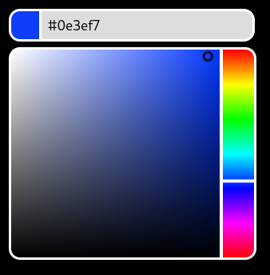

## Installation

```js
import Chroma from 'chromapicker';
```

or

```html
<link
  rel="stylesheet"
  href="https://unpkg.com/chromapicker@1.0.0/dist/chromapicker.css"
/>
<script src="https://unpkg.com/chromapicker@latest/dist/chroma.umd.js"></script>
```

## Usage

```html
<input id="example-picker" />
<script>
  const instance = new Chroma('#example-picker', {
    initialColor: '#000000',
  });
</script>
```

## Preview



<br>
<p align="center">
  © 2025 Emma (prpl.wtf)
  <br/><br/>
</p>
